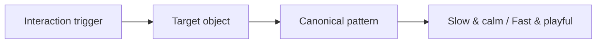

# Motion Interaction Catalog

Deduplicated motion patterns for **future motion generation and creatives**. Pair with `mood-to-motion-map-out/` for feeling → timing presets.

**Machine-readable source:** `motion-interaction-catalog.json`

---

## Logic: Trigger → Object → Pattern



1. Choose **when** motion runs (trigger).
2. Choose **what** moves (object).
3. Pick the **pattern** (see lookup table below).
4. Apply **slow & calm** or **fast & playful** numbers from the pattern entry.

---

## Interaction triggers

| ID | When |
|----|------|
| `onPageLoad` | First paint, hero mount, loader complete |
| `onInViewOnce` | Block enters viewport (once) |
| `onScrollScrub` | Position locked to scroll (scrub) |
| `onScrollProgress` | Opacity/color/transform vs scroll range |
| `onHover` | Pointer over control or card |
| `onClickActive` | Press / active state |
| `onOpenToggle` | Menu, modal, fleet, tab overlay |
| `onAutoInterval` | Timer: tabs, carousel, rotating copy |
| `onAmbientLoop` | Infinite loop: marquee, shine, video breath |
| `onCursorMove` | Follow pointer: mask, ripple, magnetic |

## Target objects

| ID | Examples |
|----|----------|
| `typography` | H1, words, lines, letters |
| `heroSection` | Badge → title → subhead → CTA |
| `card` | Features, trust chips, portfolio tiles |
| `button` | CTA, pills, gradient-border btn |
| `navigation` | Header links, fullscreen menu |
| `overlayPanel` | Tab body, wizard, glass footer |
| `media` | HLS hero, poster, scroll video |
| `chartData` | Line chart, stat cards |
| `background` | Parallax, marquees, ambient video |
| `deckSlide` | Pitch slides, horizontal deck |

---

## Quick lookup (trigger × object → pattern)

| Trigger | Object | Primary patterns |
|---------|--------|------------------|
| Page load | Hero | Sequential block stagger, Blur reveal, Fade rise up |
| Page load | Typography | Typography stagger, Mask slide, Blur reveal |
| Page load | Card | Fade rise up, Panel slide in |
| In view once | Card / section | Fade rise up |
| In view once | Typography | Typography stagger, Blur reveal, Fade down |
| Scroll scrub | Media | Scroll-scrubbed media |
| Scroll scrub / progress | Background / hero | Parallax layered, Cinematic section |
| Scroll progress | Typography | Scroll text highlight |
| Hover | Button / card / nav | Hover micro-feedback |
| Active click | Button | Press active feedback |
| Open toggle | Nav / overlay | Menu overlay open, Opacity fade, Panel slide |
| Auto interval | Deck / hero / cards | Auto-cycle content, Deck slide transition |
| Ambient loop | Background | Marquee H/V, Breathing video |
| Ambient loop | Typography | Ambient text surface (shine/neon) |
| Cursor move | Background / hero | Cursor reveal effects |

---

## Timing cheat sheet

| Intent | Duration | Easing | Stagger | Movement |
|--------|----------|--------|---------|----------|
| **Slow & calm** | 0.9–1.6s | ease-out, soft cubic | 0.12–0.35s | 12–20px |
| **Default** | 0.5–0.8s | ease-out | 0.1–0.2s | 24–30px |
| **Fast & playful** | 0.2–0.45s | ease-out / spring | 0.04–0.08s | 32–48px |

---

## Canonical patterns (26)

Duplicates from your source list are merged under **aliases**; only one entry per motion idea.

### 1. Fade rise up
**Triggers:** page load, in view once · **Objects:** typography, hero, card, chart  
**Feel:** Invisible → slightly below → eases up; polished, unobtrusive.  
**Aliases:** `fadeInUp`, `useInView fade-in-up`, `popup-card-in`, feature/stat card rise  

| | Slow & calm | Fast & playful |
|---|-------------|----------------|
| Duration | 1.0–1.2s | 0.35–0.45s |
| Y | 16px | 40px |
| Stagger | 0.15–0.2s | 0.05–0.08s |
| Mood | Luxury, wellness, finance | Startup, social, promo |

**Source:** `@keyframes fadeInUp translateY(30px)`; `useInView 0.8s stagger 0.1–0.5s`; `popup-card-in scale(0.96) delay i*150ms`

---

### 2. Sequential block stagger
**Triggers:** page load · **Objects:** hero, navigation  
**Feel:** Ordered hero beats (badge → title → body → CTA), not simultaneous pop.  
**Aliases:** `fade-rise`, `blur-fade-up` chain, Digitwist/Taskora hero  

| | Slow & calm | Fast & playful |
|---|-------------|----------------|
| Per block | 1.0–1.4s | 0.45–0.55s |
| Delays | 0.35 / 0.7 / 1.05s | 0.08 / 0.16 / 0.24s |
| Mood | Resort, film hero | Consumer app, events |

**Source:** `.animate-fade-rise-delay`; logo→nav→title stagger ms; Digitwist pre-headline→buttons chain

---

### 3. Opacity fade (no travel)
**Triggers:** page load, open toggle, auto interval · **Objects:** overlay, deck, copy  
**Feel:** Cross-dissolve only; tab swaps and slide changes.  
**Aliases:** plain fade-in, `fadeInOverlay`, deck opacity  

| | Slow & calm | Fast & playful |
|---|-------------|----------------|
| Duration | 0.8–1.2s | 0.15–0.25s |
| Extra | optional 8px drift | optional scale 0.98→1 |

**Source:** `fade-in 0.5s`; overlay `0.4s`; `opacity isActive 0.35s`

---

### 4. Blur reveal
**Triggers:** page load, in view, open toggle · **Objects:** typography, hero, overlay, media  
**Feel:** Rack-focus / wake-up; 4–24px blur clears with opacity (and optional Y).  
**Aliases:** fade-up blur, `BlurIn`, `BlurReveal`, fleet background blur  

| | Slow & calm | Fast & playful |
|---|-------------|----------------|
| Duration | 1.1–2s | 0.45–0.65s |
| Blur | 8–24px→0 | 6–12px→0 |

**Source:** `blur(4px) translateY(20px)`; BlurIn `blur(20px) 1.2s`; BlurReveal `blur(8px) 0.9s`

---

### 5. Fade down enter
**Triggers:** in view, page load · **Objects:** typography, hero, button  
**Feel:** Drops in from above (−Y) under main headline.  
**Aliases:** `FadeDown`  

| | Slow & calm | Fast & playful |
|---|-------------|----------------|
| Y | −12→0, 0.9–1.1s | −28→0, 0.35s |

**Source:** Framer `y: -20 → 0`, delay 0.5s / 0.7s subtitle & CTA

---

### 6. Typography mask slide (curtain)
**Triggers:** page load, in view · **Objects:** typography, deck  
**Feel:** Masked slide from below—editorial blinds.  
**Aliases:** `SlideUpLine`, `WordByWordReveal`  

| | Slow & calm | Fast & playful |
|---|-------------|----------------|
| Unit | 1.0–1.2s / line | 0.35–0.4s |
| Stagger | 0.25s line / 0.08s word | 0.1s / 0.025s |

**Source:** `y: 100% → 0%` overflow hidden; word stagger `0.035s`

---

### 7. Typography stagger (letter / word)
**Triggers:** page load, in view · **Objects:** typography, hero  
**Feel:** Built per letter or word—blur, slide X, or pull-up.  
**Aliases:** `StaggeredFade`, `SplitText`, `BlurText`, `WordsPullUp`, VEX char slide  

| | Slow & calm | Fast & playful |
|---|-------------|----------------|
| Unit | 0.5–0.9s | 0.18–0.35s |
| Stagger | 0.06–0.18s | 0.02–0.06s |

**Source:** letter `i*0.03s`; BlurText `100ms/word`; SplitText `0.08s` word gap

---

### 8. Scroll-driven text highlight
**Triggers:** scroll progress · **Objects:** typography  
**Feel:** Words/letters brighten with scroll; optional gradient clip fill.  
**Aliases:** reading highlight, `ScrollRevealText`, `AnimatedLetter`, text fill  

| | Slow & calm | Fast & playful |
|---|-------------|----------------|
| Range | wide, opacity floor 0.35 | narrow, snap 0.1→1 |

**Source:** `opacity [0.2,1]` per word; `clipPath inset` fill %

---

### 9. Scroll parallax (layered)
**Triggers:** scroll scrub/progress · **Objects:** hero, background, card  
**Feel:** Foreground vs background speed; hero handoff; sticky card stack scale.  
**Aliases:** Neuralyn parallax, ContentFlow hero exit, Jack card stack  

| | Slow & calm | Fast & playful |
|---|-------------|----------------|
| Text Y | −80px long range | −280px short range |
| Card scale step | 0.015 | 0.05 |

**Source:** `y [0,-200] opacity [1,0]`; `targetScale 1 - index*0.03`

---

### 10. Scroll-scrubbed media
**Triggers:** scroll scrub · **Objects:** media, overlay, background  
**Feel:** Scrub video time or raise glass panel; giant type dissolves on scroll.  
**Aliases:** ScrollVideo, GlassPanel, ScrollFloat  

| | Slow & calm | Fast & playful |
|---|-------------|----------------|
| Page | 600vh+ smooth seek | tight mapping |
| Scrub | 2.5 | 0.8–0.9 |

**Source:** `ScrollTrigger scrub`; panel `y 100%→0`; char `yPercent 250`

---

### 11. Cinematic section transition
**Triggers:** in view, scroll · **Objects:** hero, background  
**Feel:** Full-section blur + scale + Y—lens change between chapters.  

| | Slow & calm | Fast & playful |
|---|-------------|----------------|
| Duration | 1.2–1.5s | 0.45–0.55s |
| Blur | 16px | 8px |

**Source:** enter `scale 1.05 blur 10px`; exit `scale 0.92 y -60`

---

### 12. Media crossfade (chapters)
**Triggers:** scroll, open · **Objects:** media, background  
**Feel:** Stacked videos; active chapter opacity 100%, others 0.  

| | Slow & calm | Fast & playful |
|---|-------------|----------------|
| Crossfade | 1200–1500ms | 350–450ms |

**Source:** `transition-opacity duration-700`

---

### 13. Breathing video loop
**Triggers:** ambient loop · **Objects:** media, background  
**Feel:** Loop end/start soft opacity—no hard cut.  

| | Slow & calm | Fast & playful |
|---|-------------|----------------|
| Fade | 1.2–1.8s | 0.2–0.25s |

**Source:** rAF fade first/last 0.5s of loop; reset on `ended`

---

### 14–15. Infinite marquees (H / V)
**Triggers:** ambient · **Objects:** background, card  
**Feel:** Endless logo row or image column; edge gradients.  
**Aliases:** CSS scroll, GSAP footer, InfiniteSlider, marquee Y columns  

| | Slow & calm (H) | Fast & playful (H) |
|---|-----------------|---------------------|
| Cycle | 45–60s | 12–18s |

Vertical: 50–70s calm / 15–20s playful.

---

### 16. Panel slide in
**Triggers:** page load, open · **Objects:** overlay, hero, media  
**Feel:** Dashboard from right; wizard card up on video; fleet columns stagger.  
**Aliases:** `slide-in-right`, `animate-slide-up-overlay`, fleet `x 100vw→0`  

| | Slow & calm | Fast & playful |
|---|-------------|----------------|
| Duration | 1.4–2.2s | 0.5–0.7s |

---

### 17. Chart draw & data reveal
**Triggers:** load, in view, slide active · **Objects:** chartData  
**Feel:** Stroke draws; stats rise with index delay.  

| | Slow & calm | Fast & playful |
|---|-------------|----------------|
| Draw | 3s | 0.9s |

**Source:** `stroke-dashoffset 1.8s`; StatCard `delay 0.6 + i*0.1`

---

### 18. Hover micro-feedback
**Triggers:** hover · **Objects:** button, card, nav, typography  
**Feel:** Scale, lift, pill fill, magnetic pull, shimmer border, glow CTA.  
**Aliases:** all hover scale/lift/nav/service/shimmer/glow/magnetic prompts  

| | Slow & calm | Fast & playful |
|---|-------------|----------------|
| Scale | 1.015, 0.45s | 1.08, 0.12s spring |

---

### 19. Press active feedback
**Triggers:** click active · **Objects:** button  
**Feel:** Depress or shrink—tactile click.  

| | Slow & calm | Fast & playful |
|---|-------------|----------------|
| Motion | translateY 2px | scale 0.92, 0.08s |

---

### 20. Menu & overlay open
**Triggers:** open toggle · **Objects:** navigation, overlay  
**Feel:** Circle clip expand or bouncing menu pills.  

| | Slow & calm | Fast & playful |
|---|-------------|----------------|
| Clip / bubbles | 1.1s / 0.75s | 0.4s / 0.35s |

**Source:** `clipPath circle 0%→150%`; GSAP `back.out(1.5)` stagger

---

### 21. Auto-cycle content
**Triggers:** auto interval · **Objects:** deck, hero, typography, card  
**Feel:** Tabs, testimonials, loader word cycle, rotating hero role.  

| | Slow & calm | Fast & playful |
|---|-------------|----------------|
| Interval | 7–8s tabs | 2s tabs |

**Source:** `setInterval 4s`; loader `900ms/word`; roles `2s`

---

### 22. Deck slide transition
**Triggers:** open, auto · **Objects:** deckSlide  
**Feel:** Crossfade or horizontal slide + scale; remount replays children.  

| | Slow & calm | Fast & playful |
|---|-------------|----------------|
| Transition | 0.6–0.8s fade / 1s slide | 0.18s / 0.35s bounce |

---

### 23. Cursor reveal effects
**Triggers:** cursor move · **Objects:** background, media, hero  
**Feel:** Flashlight mask, liquid ripples, GIF stamp trail.  

| | Slow & calm | Fast & playful |
|---|-------------|----------------|
| Trail | 150ms spawn, 1800ms fade | 40ms / 600ms |

---

### 24. Ambient text surface + media handoff
**Triggers:** ambient, hover, page load · **Objects:** typography, button, media  
**Feel:** Shiny sweep, neon glow; poster fades when HLS plays.  
**Note:** Liquid glass = style; combine with other patterns for motion.

| | Slow & calm | Fast & playful |
|---|-------------|----------------|
| Shine cycle | 6–8s | 1.2s |
| Poster fade | 0.8s | 0.2s |

---

## Non-motion (reference only)

- **Static layout only** — e.g. Brandly hero: no animation by design.
- **Liquid glass alone** — blur + border chrome; add fade-rise-up or hover for movement.

---

## Duplicates removed (summary)

| Merged into | Removed as separate entries |
|-------------|----------------------------|
| Fade rise up | Second `useInView` doc, popup-card vs generic fade-in-up |
| Opacity fade | Overlay vs plain fade vs deck fade (same mechanic) |
| Blur reveal | BlurIn, BlurReveal, blur-fade-up, fade-up blur |
| Typography mask | SlideUpLine vs WordByWordReveal |
| Typography stagger | StaggeredFade, SplitText, BlurText, WordsPullUp, char X slide |
| Scroll text highlight | Reading highlight, ScrollRevealText, AnimatedLetter, text fill |
| Marquee H | CSS scroll, GSAP footer, InfiniteSlider |
| Hover family | scale, lift, pill, service card, shimmer, glow, magnetic |
| Panel slide | dashboard right, slide-up-overlay, fleet columns |
| Auto-cycle | tabs, carousel, loader, rotating words |
| Deck transition | slide fade + horizontal Pro AI deck |
| Cursor effects | flashlight, liquid, GIF trail |

---

## Prompt template for generators

```text
Motion: [pattern name] on [trigger] for [object].
Feel: [one sentence from pattern].
Timing: [slow & calm | fast & playful] — duration [X], stagger [Y], movement [Z].
Implementation hint: [one source excerpt line].
Brand mood: cross-check mood-to-motion-map cluster [optional].
```

Example:

```text
Motion: Sequential block stagger on page load for hero section.
Feel: Ordered opening—badge, title, body, CTA—not simultaneous.
Timing: slow & calm — 1.2s per block, delays 0.35/0.7/1.05s, translateY 12px, ease-out.
Implementation: fade-rise-delay classes 0.2s / 0.4s between blocks.
```
